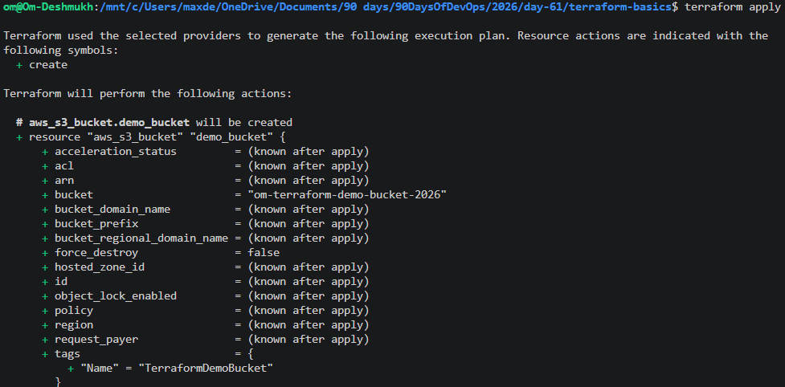
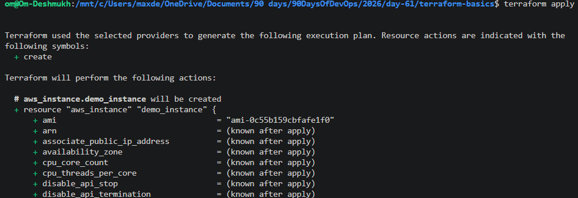

# Day 61 -- Introduction to Terraform and Your First AWS Infrastructure


# Task 1 — Understanding Infrastructure as Code (IaC)

## 1. What is Infrastructure as Code (IaC)? Why does it matter in DevOps?

Infrastructure as Code means managing servers, networks, databases, and cloud resources using code instead of creating them manually through a web console. In IaC, we write configuration files that define how the infrastructure should look, and tools like Terraform automatically create it.

IaC is important in DevOps because it makes infrastructure fast, repeatable, and consistent. Teams can create the same environment multiple times without mistakes. It also helps in automation, CI/CD pipelines, version control, and collaboration between developers and operations teams.

---

## 2. What problems does IaC solve compared to manually creating resources in the AWS Console?

When resources are created manually in the AWS Console, people can forget settings, create wrong configurations, or make environments inconsistent. Manual work is also slow and difficult to track.

IaC solves these problems by:
- Automating infrastructure creation
- Reducing human errors
- Making environments consistent
- Allowing infrastructure to be version controlled using Git
- Making rollback and recovery easier
- Saving time during deployments

For example, instead of manually creating an EC2 instance every time, Terraform can create it automatically using a `.tf` file.

---

## 3. How is Terraform different from AWS CloudFormation, Ansible, and Pulumi?

### Terraform
Terraform is mainly used for Infrastructure as Code. It works with many cloud providers like AWS, Azure, and Google Cloud. It uses HCL language and is cloud-agnostic.

### AWS CloudFormation
CloudFormation is AWS’s own IaC tool. It only works with AWS services. It is good for AWS-only environments but less flexible compared to Terraform.

### Ansible
Ansible is mainly a configuration management and automation tool. It is used for installing software, configuring servers, and automation tasks. It can create infrastructure but is not as specialized for IaC as Terraform.

### Pulumi
Pulumi is also an IaC tool, but instead of HCL, it uses programming languages like Python, JavaScript, and TypeScript. Developers who prefer coding languages may like Pulumi more.

---

## 4. What does it mean that Terraform is "declarative" and "cloud-agnostic"?

Terraform is called declarative because we only describe the final desired infrastructure state, not the step-by-step process. For example, we simply declare that we want one EC2 instance, and Terraform figures out how to create it.

Terraform is cloud-agnostic because it can work with multiple cloud providers. The same tool can manage AWS, Azure, Google Cloud, Kubernetes, Docker, and many other platforms. This makes Terraform flexible and widely used in DevOps.

---


## What is Infrastructure as Code (IaC)?

Infrastructure as Code means managing cloud infrastructure using code instead of manually creating resources from the AWS console. Using IaC tools like Terraform, we can create servers, storage, networks, and other cloud services automatically through configuration files. IaC helps make infrastructure consistent, repeatable, faster, and easier to manage. It is very important in DevOps because it supports automation, version control, and scalable deployments.

---

# Terraform Setup

## Terraform Installed Successfully

```bash
terraform -version
```

### Output
```bash
Terraform v1.x.x
```

---

# AWS CLI Configuration

```bash
aws configure
```

Configured:
- AWS Access Key
- AWS Secret Key
- Region: ap-south-1
- Output Format: json

---

# Terraform Configuration

## Resources Created
- S3 Bucket
- EC2 Instance

### EC2 Details
- AMI: `ami-0f5ee92e2d63afc18`
- Instance Type: `t2.micro`
- Tag:
```text
Name = TerraWeek-Day1
```

---

# Terraform Lifecycle Commands

## 1. Terraform Init

```bash
terraform init
```

### Purpose
- Initializes Terraform project
- Downloads AWS provider plugins
- Creates `.terraform/` directory

---

## 2. Terraform Plan

```bash
terraform plan
```

### Purpose
- Shows preview of infrastructure changes
- Displays what Terraform will create, modify, or destroy

### Symbols
| Symbol | Meaning |
|---|---|
| `+` | Create |
| `~` | Modify |
| `-` | Destroy |

---

## 3. Terraform Apply

```bash
terraform apply
```

### Purpose
- Creates or updates infrastructure
- Applies changes defined in `main.tf`

---

## 4. Terraform Destroy

```bash
terraform destroy
```

### Purpose
- Deletes all infrastructure managed by Terraform

---

## 5. Terraform Show

```bash
terraform show
```

### Purpose
- Displays human-readable current infrastructure state

---

## 6. Terraform State List

```bash
terraform state list
```

### Purpose
- Lists all resources managed by Terraform

Example:
```text
aws_instance.demo_instance
aws_s3_bucket.demo_bucket
```

---

# Terraform State File

## File Name
```text
terraform.tfstate
```

## What It Contains
The Terraform state file stores:
- Resource IDs
- Resource metadata
- Infrastructure configuration
- Current resource state
- Dependencies between resources
- Public and private attributes

Terraform uses this file to compare:
```text
Desired State vs Current State
```

This helps Terraform know:
- What already exists
- What needs modification
- What should be deleted

---

# Why the State File Matters

The state file is extremely important because Terraform depends on it to manage infrastructure correctly. Without the state file, Terraform would not know which resources belong to the project.

The state file should:
- Never be edited manually
- Never be pushed to public Git repositories

Because it may contain:
- Sensitive infrastructure data
- Resource information
- IDs and metadata

---

# Screenshots

## Screenshot 1 — Terraform Apply Output


---

## Screenshot 2 — AWS S3 Console


## Screenshot 3 — AWS EC2 Console


---

# What I Learned

- Basics of Infrastructure as Code
- Terraform workflow
- AWS provider configuration
- Managing AWS infrastructure using Terraform
- Terraform state management
- Infrastructure lifecycle commands
- Importance of Terraform state file
- Safe creation and destruction of cloud resources