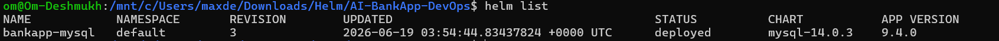
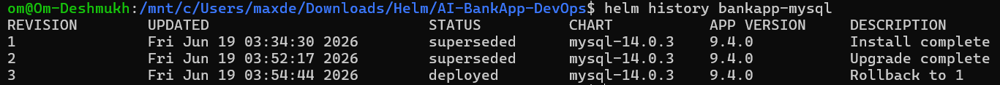
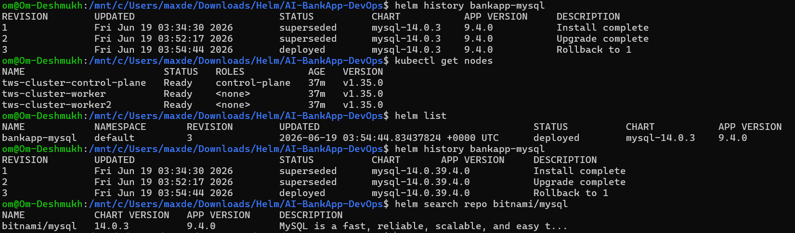

# Day 78 -- Introduction to Helm and Chart Basics

## Task Objective

The AI-BankApp project contains 12 Kubernetes YAML files for Deployments, Services, ConfigMaps, Secrets, PVCs, HPA, and other resources. Managing these files manually across multiple environments becomes difficult. Helm solves this problem by packaging Kubernetes resources into reusable and versioned charts.

---

# Task Questions and Answers

## 1. What is Helm?

Helm is a package manager for Kubernetes, similar to apt for Ubuntu or yum for RHEL.

It allows us to:

* Package Kubernetes manifests into reusable charts
* Deploy applications using a single command
* Manage application versions
* Perform upgrades and rollbacks
* Reuse the same chart across different environments using values files

---

## 2. Core Helm Concepts

### Chart

A Chart is a package containing Kubernetes resource templates.

Example:

A MySQL chart may contain:

* StatefulSet
* Service
* Secret
* ConfigMap
* PersistentVolumeClaim

All bundled together.

---

### Release

A Release is a running instance of a chart inside a Kubernetes cluster.

Example:

```bash
helm install bankapp-mysql bitnami/mysql
```

Here:

* Chart = bitnami/mysql
* Release = bankapp-mysql

---

### Repository

A Repository stores Helm charts.

Examples:

* Bitnami Repository
* Ingress NGINX Repository
* ArgoCD Repository

Example:

```bash
helm repo add bitnami https://charts.bitnami.com/bitnami
```

---

### Values

Values are configuration settings used to customize a chart.

Example:

```yaml
auth:
  rootPassword: Test@123

database:
  name: bankappdb
```

Values allow the same chart to be used in development, staging, and production environments.

---

## 3. Why Helm Instead of Raw Kubernetes Manifests?

AI-BankApp currently contains:

```text
bankapp-deployment.yml
configmap.yml
gateway.yml
mysql-deployment.yml
namespace.yml
ollama-deployment.yml
pv.yml
pvc.yml
secrets.yml
service.yml
hpa.yml
cert-manager.yml
```

Total: 12 YAML files

Problems with raw manifests:

* Manual editing
* Duplicate configurations
* Difficult upgrades
* No rollback support
* Hard to manage multiple environments

Helm Advantages:

* Reusable templates
* Version control
* Rollbacks
* Upgrades
* Dependency management
* Easier maintenance

---

# Practical Tasks Performed

## Cluster Creation

Created Kind cluster using AI-BankApp configuration.

```bash
kind create cluster --config setup-k8s/kind-config.yml
```

Verified Nodes:

```bash
kubectl get nodes
```

Output:

```text
tws-cluster-control-plane
tws-cluster-worker
tws-cluster-worker2
```

---

## Added Helm Repository

```bash
helm repo add ingress-nginx https://kubernetes.github.io/ingress-nginx

helm repo update
```

---

## Search MySQL Chart

```bash
helm search repo bitnami/mysql
```

Output:

```text
bitnami/mysql
```

---

## Install MySQL using Helm

```bash
helm install bankapp-mysql bitnami/mysql \
  --set auth.rootPassword=Test@123 \
  --set auth.database=bankappdb
```

---

## Verify Release

```bash
helm list
```

Output:

```text
NAME            NAMESPACE   REVISION
bankapp-mysql   default     1
```

---

## Upgrade Release

```bash
helm upgrade bankapp-mysql bitnami/mysql \
  --set auth.rootPassword=Test@123 \
  --set auth.database=bankappdb \
  --set metrics.enabled=true
```

---

## View Release History

```bash
helm history bankapp-mysql
```

Output:

```text
Revision 1 - Install complete
Revision 2 - Upgrade complete
```

---

## Rollback Release

```bash
helm rollback bankapp-mysql 1
```

Result:

```text
Revision 3 - Rollback to 1
```

---

# MySQL Values File

## mysql-values.yaml

```yaml
auth:
  rootPassword: Test@123
  database: bankappdb

metrics:
  enabled: true
```

## Explanation

### auth.rootPassword

Sets the MySQL root password.

### auth.database

Creates the database automatically during deployment.

### metrics.enabled

Enables metrics collection for monitoring.

---

# Helm Chart Directory Structure

Typical Helm Chart Structure:

```text
mychart/
│
├── Chart.yaml
├── values.yaml
├── charts/
├── templates/
│   ├── deployment.yaml
│   ├── service.yaml
│   ├── configmap.yaml
│   ├── secret.yaml
│   └── pvc.yaml
│
└── README.md
```

### Chart.yaml

Contains chart metadata.

Example:

```yaml
apiVersion: v2
name: mychart
version: 1.0.0
```

---

### values.yaml

Default configuration values for the chart.

---

### templates/

Contains Kubernetes resource templates.

Examples:

* Deployment
* Service
* ConfigMap
* Secret
* PVC

---

### charts/

Stores chart dependencies.

Example:

An application chart can depend on:

* MySQL
* Redis
* Prometheus

---

# Comparison: Raw YAML vs Helm

| Feature             | Raw YAML  | Helm     |
| ------------------- | --------- | -------- |
| Multiple Files      | Yes       | No       |
| Templating          | No        | Yes      |
| Upgrade Support     | Manual    | Built-in |
| Rollback Support    | No        | Yes      |
| Versioning          | No        | Yes      |
| Reusability         | Low       | High     |
| Environment Support | Difficult | Easy     |

---

# Screenshots Required

## Screenshot 1

```bash
helm list

```

Insert screenshot showing deployed release.

---

## Screenshot 2

```bash
helm history bankapp-mysql

```

Insert screenshot showing:

* Revision 1
* Revision 2
* Revision 3

---

# Conclusion

Helm simplifies Kubernetes application deployment by packaging resources into reusable charts. It provides versioning, upgrades, rollbacks, dependency management, and environment-specific configuration through values files. Compared to managing 12 raw YAML files in AI-BankApp, Helm offers a more scalable and maintainable deployment approach.
