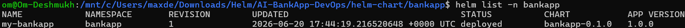
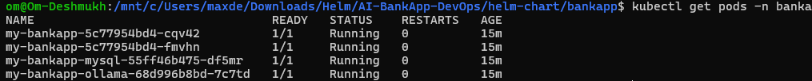
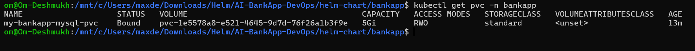
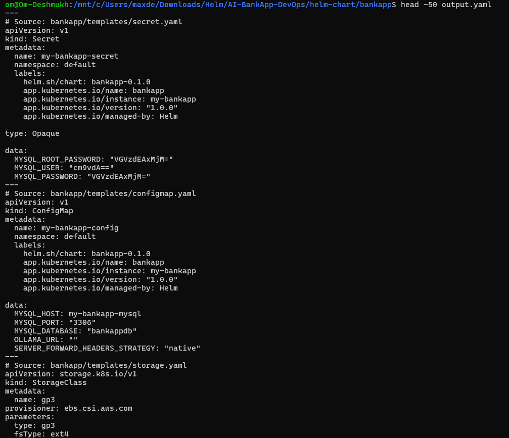
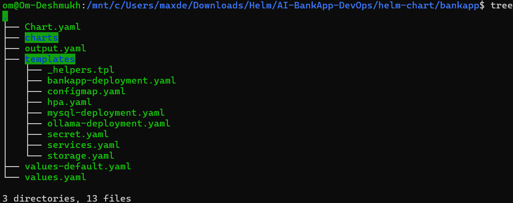
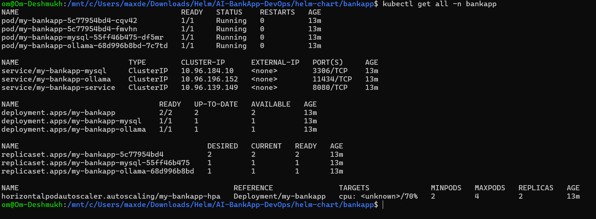

# Day 79 - Convert AI-BankApp to Helm Chart

## Task

Convert the AI-BankApp Kubernetes manifests into a reusable Helm chart.

### Documentation Requirements

* Side-by-side comparison: raw `k8s/` manifests vs Helm templates (pick 2-3 files)
* Complete `values.yaml` with explanations
* Go template syntax cheat sheet:

  * `{{ .Values }}`
  * `if`
  * `range`
  * `with`
  * `include`
  * `toYaml`
  * `nindent`
  * `b64enc`
* Output of `helm template` showing rendered manifests
* Screenshot of the AI-BankApp running via Helm on Kind
* Demonstrate how disabling Ollama (`ollama.enabled=false`) removes all related resources

---

# Objective

The goal of this task was to convert existing Kubernetes manifests into a reusable Helm chart that supports environment-specific configuration and easier application deployment.

---

# Helm Chart Structure

```text
bankapp/
├── Chart.yaml
├── values.yaml
├── templates/
│   ├── _helpers.tpl
│   ├── configmap.yaml
│   ├── secrets.yaml
│   ├── storage.yaml
│   ├── bankapp-deployment.yaml
│   ├── mysql-deployment.yaml
│   ├── ollama-deployment.yaml
│   ├── services.yaml
│   └── hpa.yaml
```

---

# Raw Kubernetes Manifest vs Helm Template

## Example 1: ConfigMap

### Raw Kubernetes Manifest

```yaml
apiVersion: v1
kind: ConfigMap
metadata:
  name: bankapp-config

data:
  MYSQL_HOST: mysql-service
  MYSQL_PORT: "3306"
  MYSQL_DATABASE: bankappdb
```

### Helm Template

```yaml
apiVersion: v1
kind: ConfigMap
metadata:
  name: {{ include "bankapp.fullname" . }}-config

data:
  MYSQL_HOST: {{ include "bankapp.fullname" . }}-mysql
  MYSQL_PORT: "3306"
  MYSQL_DATABASE: {{ .Values.config.mysqlDatabase | quote }}
```

### Benefit

Configuration values can now be changed from `values.yaml` without modifying templates.

---

## Example 2: Secret

### Raw Kubernetes Manifest

```yaml
data:
  MYSQL_ROOT_PASSWORD: VGVzdEAxMjM=
```

### Helm Template

```yaml
data:
  MYSQL_ROOT_PASSWORD: {{ .Values.secrets.mysqlRootPassword | b64enc | quote }}
```

### Benefit

Sensitive values are managed through Helm values and encoded automatically.

---

## Example 3: Deployment

### Raw Kubernetes Manifest

```yaml
spec:
  replicas: 4

  containers:
  - image: trainwithshubham/ai-bankapp-eks:1c7cb0e
```

### Helm Template

```yaml
spec:
  replicas: {{ .Values.bankapp.replicaCount }}

  containers:
  - image: "{{ .Values.bankapp.image.repository }}:{{ .Values.bankapp.image.tag }}"
```

### Benefit

Deployment scaling and image versions are configurable without editing manifests.

---

# Complete values.yaml Explained

## BankApp

```yaml
bankapp:
  replicaCount: 4
```

Number of application replicas.

```yaml
image:
  repository: trainwithshubham/ai-bankapp-eks
  tag: "1c7cb0e"
```

Application image details.

```yaml
service:
  type: ClusterIP
  port: 8080
```

Service configuration.

---

## MySQL

```yaml
mysql:
  enabled: true
```

Deploy MySQL resources.

```yaml
persistence:
  size: 5Gi
```

Persistent storage allocation.

---

## Ollama

```yaml
ollama:
  enabled: true
```

Deploy Ollama resources.

```yaml
model: tinyllama
```

Model configuration.

---

## Secrets

```yaml
secrets:
  mysqlRootPassword: Test@123
  mysqlUser: root
  mysqlPassword: Test@123
```

Database credentials.

---

# Helm Go Template Cheat Sheet

## Values

```yaml
{{ .Values.bankapp.replicaCount }}
```

Access values from `values.yaml`.

---

## if

```yaml
{{- if .Values.mysql.enabled }}
...
{{- end }}
```

Conditional resource creation.

---

## range

```yaml
{{- range .Values.list }}
...
{{- end }}
```

Loop through a list.

---

## with

```yaml
{{- with .Values.bankapp.resources }}
...
{{- end }}
```

Shortens nested references.

---

## include

```yaml
{{ include "bankapp.fullname" . }}
```

Reuse helper templates.

---

## toYaml

```yaml
{{ toYaml . }}
```

Convert objects into YAML.

---

## nindent

```yaml
{{ toYaml . | nindent 12 }}
```

Add indentation.

---

## b64enc

```yaml
{{ .Values.secrets.mysqlPassword | b64enc }}
```

Base64 encode secret values.

---

# helm template Output

Command:

```bash
helm template my-bankapp .
```

Example Rendered Output:

```yaml
apiVersion: v1
kind: ConfigMap
metadata:
  name: my-bankapp-config

data:
  MYSQL_DATABASE: "bankappdb"
```

Example Deployment:

```yaml
apiVersion: apps/v1
kind: Deployment
metadata:
  name: my-bankapp
```

This verifies the final Kubernetes manifests before deployment.

---

# Disabling Ollama

Current:

```yaml
ollama:
  enabled: true
```

Disable:

```yaml
ollama:
  enabled: false
```

Resources Removed:

* Ollama Deployment
* Ollama Service
* Ollama PVC
* Ollama Init Container

This demonstrates conditional Helm resource generation.

---

# Validation Commands

```bash
helm lint .
```

Validate Helm chart.

```bash
helm template my-bankapp .
```

Render Kubernetes manifests.

```bash
helm install my-bankapp .
```

Deploy application.

---

# Deployment Result

Successfully converted AI-BankApp Kubernetes manifests into a reusable Helm chart.

Completed:

* Helm Chart Creation
* Helm Templates
* ConfigMap & Secret Templating
* PVC & Storage Configuration
* Deployment Templates
* Service Templates
* HPA Configuration
* Helm Validation
* Helm Deployment on Kind Cluster

---

# Screenshot

screenshots of:

1. `Helm Release`

2. `Pods`

3. `PVC`

4. `Helm Rendered Output .`

5. `Helm Chart Structure.`

6. `kubectl get all -n bankapp`
